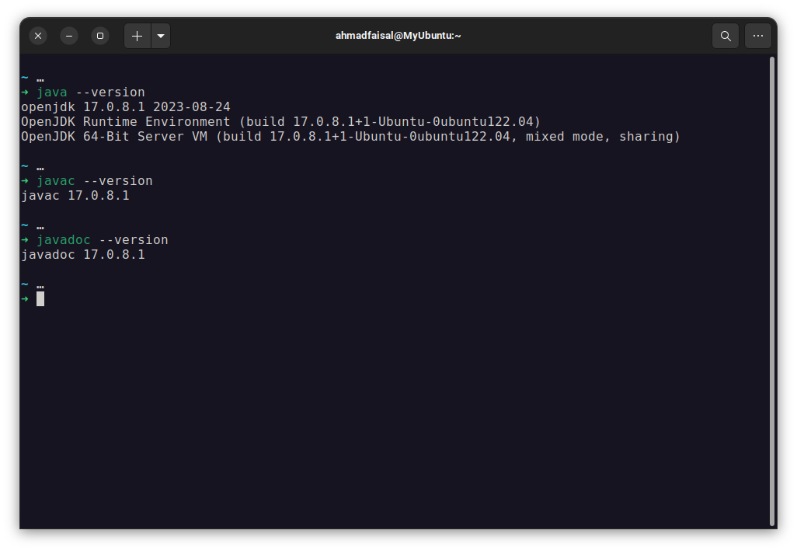
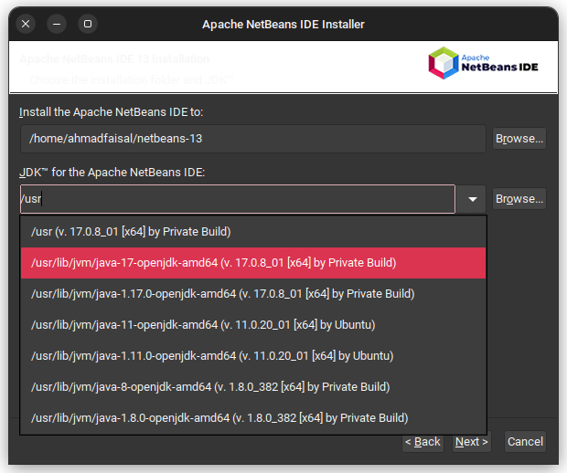
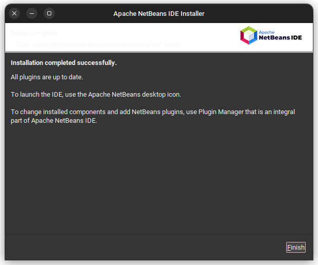

# Pengenalan Object Oriented Programming

## Apa Itu Object Oriented Programming?

// apa itu oop?

## Instalasi Software (JDK 17 dan Netbeans 13)

Dalam praktikum mata kuliah Pemrograman Berorientasi Object, mahasiswa akan menggunakan 2 software berikut:

1. JDK 17 (Java Development Kit 17). Merupakan lingkungan pengembangan untuk bahasa Java. Di dalam JDK, terdapat development tools untuk pengembangan Java dan JRE (Java Runtime Environment) yang berisi Java Virtual Machine (JVM). JVM digunakan untuk melakukan eksekusi program Java. Di praktikum ini, mahasiswa menggunakan JDK versi 17.

2. NetBeans 13. Netbeans merupakan IDE (Integrated Development Environments) yang sering digunakan untuk pengembangan Java. Dalam praktikum ini, mahasiswa menggunakan NetBeans versi 13. 

### Instalasi di Windows

// install di windows
### Instalasi di Linux (Debian, Ubuntu, dan turunannya)

#### Install Java Development Kit 17
Update *package list* sistem operasi dengan menjalankan command berikut:

```bash
sudo apt update
```

Kemudian, install package `openjdk-17-jdk` dengan cara:

```bash
sudo apt install openjdk-17-jdk
```

Setelah selesai, maka instalasi Java akan terletak di `/usr/lib/jvm/java-17-openjdk-amd64`. Untuk berjaga-jaga, buat environment variable baru dengan nama `JAVA_HOME` dengan cara:

1. Buka file `~/.bashrc` dengan perintah: `vim ~/.bashrc` (bisa menggunakan text editor lain).
2. Pada bagian paling akhir file, tambahkan baris baru dan tuliskan: `JAVA_HOME="/usr/lib/jvm/java-17-openjdk-amd64"`. Kemudian, simpan dan keluar.
3. Setelah itu, reload shell dengan perintah: `source ~/.bashrc`.

Kemudian, periksa instalasi Java dengan ketiga perintah berikut:

```bash
java --version
javac --version
javadoc --version
```

Jika ada output seperti berikut, maka instalasi Java telah berhasil.



#### Install Netbeans 13

Pertama-tama, download installer script Netbeans 13 dari web [apache.org](apache.org) dengan perintah berikut:

```bash
wget -c -O Apache-NetBeans-13-bin-linux-x64.sh https://archive.apache.org/dist/netbeans/netbeans-installers/13/Apache-NetBeans-13-bin-linux-x64.sh
```

Masuk ke direktori `/tmp`. Kemudian, beri hak akses *execute* oleh user terhadap file tersebut:

```bash
cd /tmp
chmod u+x Apache-NetBeans-13-bin-linux-x64.sh
```

Setelah itu, jalankan installer script tersebut dengan perintah berikut:

```
./Apache-NetBeans-13-bin-linux-x64.sh
```

Maka, akan muncul installer wizard. Klik **next** hingga menemui bagian pemilihan path instalasi Netbeans dan JDK untuk Netbeans.

- **Path instalasi Netbeans**: biarkan default
- **Path JDK** : Pilih path JDK 17 yang baru saja diinstall, yaitu `/usr/lib/jvm/java-17-openjdk-amd64`.



Klik **next** hingga pilih **install**. Tunggu hingga instalasi selesai. Lalu klik **Finish**.




## Proyek Pertama

1. Buka IDE NetBeans. Lihat tab di pojok kiri atas. Pilih `File -> New Project`.

    

2. Pilih kategori `Java with Maven` dan project `Java Application`.

    

3. Beri nama project `praktikum1`. Teman-teman juga bisa mengubah lokasi project. Tetapi biarkan default untuk sekarang. Lalu, klik **Finish**

    

4. Setelah itu, akan muncul tampilan berikut.

    

    Ada beberapa bagian utama yang perlu diperhatikan:

    - Block atas: `tab bar`, berisi menu-menu utama NetBeans.
    - Block kiri atas: `project tree`, yaitu daftar direktori dan file dalam project Java untuk navigasi file/direktori.
    - Blok kanan atas: `code editor`, yaitu tempat menulis kode Java.
    - Blok kanan bawah: `terminal`, yaitu tempat dieksekusinya project Java. Block ini akan menampilkan build process, build status, dan output project Java ketika dijalankan.

5. Coba ubah `Hello World` menjadi `Hello Informatika`, kemudian klik tombol **Run Project** (tombol ini ada di tab bar, berbentuk panah hijau). Setelah itu, perhatikan block terminal, **apa yang terjadi?**

    