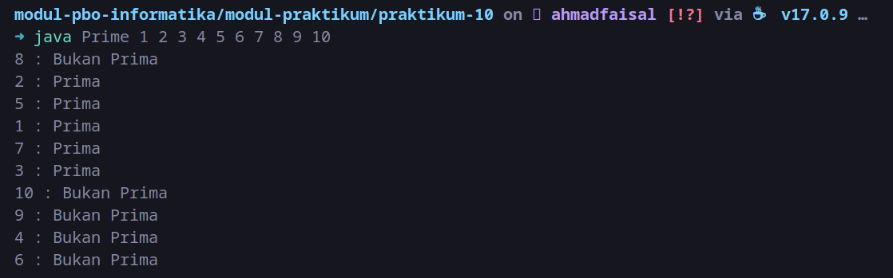

# Tugas Week 10: Multithreading

Buatlah membuat program multithreading untuk mengecek apakah suatu angka merupakan bilangan prima atau bukan. Contoh:

Format Tugas:

1. Kumpulkan zip file, berisi:
    * **Main.java**
    * **GeneratePrimeThread.java**
    * **{NIM}-{NAMA}-{KELAS}.pdf**, berisi penjelasan dan screenshot full screen kode dan hasilnya.
2. Zip file format: **{NIM}-{NAMA}-{KELAS}.zip**