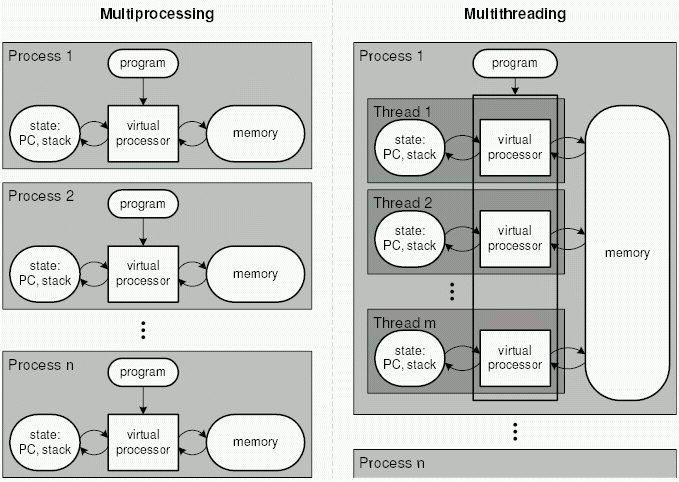
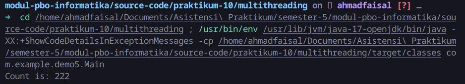

# Multithreading di Java

Multithreading merupakan konsep dalam pemrograman dimana sebuah aplikasi dapat membuat unit-unit tugas kecil yang dijalankan secara paralel. Satuan unit tugas tersebut disebut dengan *thread*.

Jika sebuah *thread* itu adalah unit tugas, lalu apa bedanya dengan *process*? Silakan lihat gambar di bawah ini.


Dalam hal ini, dapat dikatakan bahwa suatu *process* minimal memiliki 1 *thread*.

## 1 Multiprocessing vs Multithreading



Perbedaan multiprocess dan multithread:

Nomor | Multiprocess | Multithread
--- | --- | ---
1 | banyak proses dieksekusi secara konkuren | banyak thread dalam 1 proses dieksekusi secara konkuren
2 | menambah CPU untuk menigkatkan kekuatan komputasi | membuat banyak thread dalam 1 proses untuk meningkatkan kekuatan komputasi
3 | pembuatan proses membutuhkan waktu dan resource yang besar | pembuatan thread lebih ekonomis dalam segi waktu dan resource
4 | bergantung pada object di memori untuk mengirim data ke proses lain | tidak bergantung pada object lain
5 |child process sebagian besar bersifat interruptible / killable | multithreading tidak bersifat interruptible / killable

## 2 Thread Lifecycle di Java

Daur hidup (*lifecycle*) dari Thread terdiri dari beberapa tahap.


### 2.1 New

Tahapan awal adalah tahap ketika *thread* baru saja dibuat/diinisiasikan.

### 2.2 Runnable

Kemudian, thread dapat ditugaskan ke suatu tugas dan mempersiapkan untuk tugas tersebut.

### 2.3 Running

Thread dieksekusi untuk menjalankan tugasnya hingga selesai atau jika terjadi interupsi.

### 2.4 Waiting

Pada suatu skenario, sebuah thread harus menunggu thread lainnya selesai karena thread tersebut membutuhkan thread lainnya. Misalnya pada saat mengakses *shared variable* (nanti dijelaskan).

### 2.5 Dead

Terakhir, *thread* yang sudah selesai melakukan tugasnya akan diterminasi oleh JVM.

## 3 Membuat Thread

Untuk membuat thread di Java, sebuah class dapat dibuat dari parent `Thread`, atau bisa juga dengan mengimplementasikan class `Runnable`.  Namun, di modul ini kita akan menggunakan `Runnable`.

Dalam class yang dibuat, lakukan overriding pada method `run()` untuk mendefinisikan tugas yang akan dijalankan oleh *thread*.

Untuk menjalankan tugas dari thread, silakan jalankan method `start()`

File `classes/Runner.java`:

```java
public class Runner extends Runnable{
  @Override
  public void run() {
    for (int i = 0; i < 10; i++) {
      System.out.println("Thread #1: " + i);
      try {
        Thread.sleep(100);
      } catch (InterruptedException e) {
        e.printStackTrace();
      }
    }
  }
}

```

File `Main.java`:

```java
public class Main {
    public static void main(String[] args) {
        Thread thread1 = new Thread(new Runner());
        
        thread1.start();
    }
}
```

Selain dengan membuat sebuah class, sebuah thread juga dapat diinisiasikan secara inline. Misalnya, di file `Main.java`:


File `Main.java`:

```java
public class Main {
    public static void main(String[] args) {
        Thread thread1 = new Thread(new Runner());
        
        Thread thread2 = new Thread(new Runnable() {
          @Override
          public void run() {
            for (int i = 10; i > 0; i--) {
              System.out.println("Thread #2: " + i);
              try {
                Thread.sleep(1000);
              }catch(InterruptedException e){
                e.printStackTrace();
              } 
            }
          }
        });

        thread1.start();
        thread2.start();
    }
}
```

Setelah menjalankan code tersebut, apa yang terjadi?

## Synchronize Thread

Terdapat kasus dimana ada lebih dari 1 thread yang mengakses sumber daya yang sama, katakanlah sebuah nilai pada variable. Variable ini disebut dengan *shared variable*.

Mari kita pelajar studi kasus berikut:

File `Main.java`:

```java
public class Main {
  // shared variable
  private int count = 0;

  public static void main(String[] args) {
    Main main = new Main();
    main.doWork();
  }

  public void doWork() {
    Thread t1 = new Thread(new Runnable() {
      @Override
      public void run() {
        for (int i = 0; i < 10000; i++) {
          count = count + 1;
        }
      }
    });

    Thread t2 = new Thread(new Runnable() {
      @Override
      public void run() {
        for (int i = 0; i < 10000; i++) {
          count = count + 1;
        }
      }
    });

    t1.start();
    t2.start();

    System.out.println("Count is: " + count);
  }

}

```

Apakah kamu mengekspektasikan bahwa nilai `count` di akhir program adalah `20000`? Jika iya, maka kamu salah :)



Hal ini terjadi karena hal berikut:

1. Dua thread (`t1` dan `t2` mengakses sumber daya yang sama, yaitu `count`).
2. Setiap thread memiliki operasi `count = count + 1`. Operasi ini memiliki 3 operasi kecil, yaitu:

    * mengambil nilai `count`
    * menambahakan nilai `count` dengan 1
    * melakukan assignment hasil operasi barusan ke variabel `count`.
3. Operasi di atas dijalankan oleh dua thread secara konkuren, dengan memodifikasi nilai `count`.
4. Terdapat banyak proses yang asinkron, misalnya setelah `t1` mengambil nilai 102, ternyata `t2` melakukan assignment nilai 60. Sehingga `count` yang harusnya bernilai 102, menjadi 60. Hal ini memungkinkan karena kedua thread tersebut memodifikasi sumber daya yang sama.

Kejadian ini disebut dengan *thread interleaving*.

Untuk memperbaiki masalah tersebut, perbarui `Main.java` menjadi seperti berikut:

```java
package com.example.demo5;

public class Main {
  private int count = 0;

  // code locking with synchronized (mutex lock)
  public synchronized void increment() {
    count++;
  }

  public static void main(String[] args) {
    Main main = new Main();
    main.doWork();
  }

  public void doWork() {
    Thread t1 = new Thread(new Runnable() {
      @Override
      public void run() {
        for (int i = 0; i < 10000; i++) {
          increment();
        }
      }
    });

    Thread t2 = new Thread(new Runnable() {
      @Override
      public void run() {
        for (int i = 0; i < 10000; i++) {
          increment();
        }
      }
    });

    t1.start();
    t2.start();

    try {
      t1.join();
      t2.join();
    } catch (InterruptedException e) {
      e.printStackTrace();
    }

    System.out.println("Count is: " + count);
  }

}
```

Pada kode terbaru, kita melakukan `code locking` dengan `mutex lock`. Dimana operasi ini dilakukan di fungsi `increment()`. Cara ini dilakukan agar ketika suatu thread menjalankan fungsi `increment`, maka `count` tidak bisa diakses oleh `thread` lainnya (melakukan waiting).

Dalam artian sederhana, tidak ada thread lain yang boleh memodifikasi `count` ketika ada suatu thread yang memodifikasi file tersebut. Aturan ini ada karena `mutex lock` melalui keyword `synchronized`.