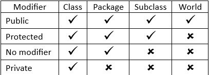

# Class dan Object di JAVA
Pembahasa materi : 
1. class and object
2. constructor
3. modifiers
4. encapsulation

## 1. class and object
### 1.1 Pengertian Dasar
**Class** adalah cetak biru atau blueprint dari object. Class bertugas untuk mengumpulkan prosedur/fungsi dan variabel dalam satu tempat. Sebagai analogi, class bisa diibaratkan dengan Handphone, yakni gambaran umum tentang sebuah benda.

Berikut adalah contoh penulisan class dalam bahasa Java:


```java
class Handphone {
	  // isi dari class Handphone...
	  // isi dari class Handphone...
	}
```
Object atau objek adalah hasil cetak dari class, atau bisa juga disebut hasil konkrit dari class. Masih menggunakan analogi class Handphone, maka object dari class Handphone bisa berupa: `HandphoneRudi, HandphoneLisa, atau Handphonedoni`. Sebuah object dari class Handphone akan memiliki seluruh ciri-ciri Handphone, termasuk atribut dan method-nya. Proses mencetak object dari class ini disebut dengan `instansiasi` (atau instantiation).

Berikut adalah contoh penulisan class dalam bahasa Java:

```java
class BelajarJava {
	  public static void main(String args[]){
	    Handphone HandphoneRudi = new Handphone(); // instansiasi object baru dari class
	    Handphone HandphoneLisa = new Handphone(); // instansiasi object baru dari class
	  }
	}
```

Secara default class untuk main adalah sebagai berikut:
```java
public class HelloWorld {

    public static void main(String args[]){
        System.out.println("Hello World");
    }

}
```
Nama filenya harus `HelloWorld.java` sesuai mengikuti nama `class utama` nya, jika pakai nama yang berbeda nanti `programnya tidak mau di-compile`. Ini sudah menjadi aturan di java, `nama file harus mengikuti nama class`.

### 1.2 Cara membuat class dan object
```java
class Handphone {
	  
	// buat 3 stribut untuk class Handphone
	String pemilik;
	String merk;
	double ukuranLayar;
	  
	// buat 2 method untuk class Handphone
	String hidupkanHandphone() {
	    return "Hidupkan Handphone";
	}
	  
	String matikanHandphone() {
	    return "Matikan Handphone";
	}
};
	 
class BelajarJava {
	 
	public static void main(String args[]){
	    Handphone HandphoneAndi = new Handphone();
	}
	   
}
```
Di antara baris 1-16, terdapat perintah untuk membuat class Handphone lengkap dengan 3 stribut dan 2 method. Kemudian di baris 18 – 24 terdapat perintah untuk membuat class BelajarJava yang akan meng-instansiasi object `HandphoneAndi` dari class Handphone. Agar kita bisa menampilkan dan mengakses isi sebuah object, object tersebut harus di buat dari dalam method `public static void main()`.

### 1.3 Cara Mengakses Object dalam Java

```java
class Handphone {
	  
	// buat 3 atribut untuk class Handphone
	String pemilik;
	String merk;
	double ukuranLayar;
	  
	// buat 2 method untuk class Handphone
	String hidupkanHandphone() {
	    return "Hidupkan Handphone";
	}
	  
	String matikanHandphone() {
	    return "Matikan Handphone";
	}
};
	 
class BelajarJava {
	 
	public static void main(String args[]){
	     
	    // buat object dari class Handphone (instansiasi)
	    Handphone HandphoneAnto = new Handphone();
	  
	    // set nilai atribut
	    HandphoneAnto.pemilik = "Anto";
	    HandphoneAnto.merk = "Asus";
	    HandphoneAnto.ukuranLayar = 15.6;
	    
	    // tampilkan atribut object Handphone
	    System.out.println(HandphoneAnto.pemilik);
	    System.out.println(HandphoneAnto.merk);
	    System.out.println(HandphoneAnto.ukuranLayar);
	    
	    // tampilkan hasil method object Handphone
	    System.out.println(HandphoneAnto.hidupkanHandphone());
	    System.out.println(HandphoneAnto.matikanHandphone() );
	}
	   
}
```
Kita fokus pada class BelajarJava.

code di bawah ini adalah cara untuk membuat object baru(instasiasi).

```java
class BelajarJava {
	public static void main(String args[]){
	    Handphone HandphoneAnto = new Handphone();
	    ...
	}
}
```
code di bawah ini adalah cara untuk untuk mengisi variabel dari object baru, di perintah tersebut variabel akan di isikan pada variabel masing-masing object.
```java
HandphoneAnto.pemilik = "Anto";
HandphoneAnto.merk = "Asus";
HandphoneAnto.ukuranLayar = 15.6;
```
code berikut adalah cara untuk mengakses atribut pada tiap object yang sudah kita isi nilai sebelumnya.
```java
System.out.println(HandphoneAnto.pemilik);
System.out.println(HandphoneAnto.merk);
System.out.println(HandphoneAnto.ukuranLayar);
```
### 1.4 Object Sebagai Entitas Terpisah
Dalam contoh kode di atas kita hanya menggunakan 1 buah object yang dari class Handphone. Pada dasarnya sebuah class bisa dipakai untuk membuat banyak object. Setiap object akan saling terpisah namun tetap memiliki semua atribut dan method yang berasal dari class Handphone.

Berikut adalah contoh pembuatan beberapa object dari class Handphone:
```java
class Laptop {
	String pemilik;
	String hidupkanLaptop() {
	    return "Hidupkan Laptop";
	}
};
	 
class BelajarJava {
	 
	public static void main(String args[]){
	     
	    Laptop laptopAnto = new Laptop();
	    Laptop laptopAndi = new Laptop();
	    Laptop laptopDina = new Laptop();
	  
	    laptopAnto.pemilik = "Anto";
	    laptopAndi.pemilik = "Andi";
	    laptopDina.pemilik = "Dina";
	    
	    System.out.println("Pemilik Laptop: " + laptopAnto.pemilik);
	    System.out.println("Pemilik Laptop: " + laptopAndi.pemilik);
	    System.out.println("Pemilik Laptop: " + laptopDina.pemilik);
	 
	}
	   
}
```
kita coba contoh lain sebagai berikut:
```java
public class Player {
	    
	// definisi atribut
	String name;
	int speed;
	int healthPoin;

	// definisi method run
	void run(){
	    System.out.println(name +" is running...");
	    System.out.println("Speed: "+ speed);
	}

	// definisi method isDead untuk mengecek nilai kesehatan (healthPoin)
	boolean isDead(){
	    if(healthPoin <= 0) return true;
	    return false;
	}
	    
}
public class Game {
	public static void main(String[] args){

	    // membuat objek player
	    Player petani = new Player();

	    // mengisi atribut player
	    petani.name = "Petani Kode";
	    petani.speed = 78;
	    petani.healthPoin = 100;

	    // menjalankan method
	    petani.run();

	    if(petani.isDead()){
	        System.out.println("Game Over!");
	    }

	}
}
```
Save dan coba eksekusi Game.java

## 2. Constructor
### 2.1 Pengertian Dasar
**Constructor** adalah method khusus yang dijalankan secara otomatis pada saat sebuah object dibuat, yakni saat proses instansiasi. Dalam bahasa Java, constructor dibuat dengan cara menulis sebuah method yang namanya sama dengan nama class. Sebagai contoh jika kita memiliki class Laptop, maka function constructor juga harus bernama `Laptop()`. Sebuah constructor tidak mengembalikan nilai sehingga tidak perlu menulis tipe data sebelum nama function. Constructor juga harus memiliki hak akses public, yang apabila tidak ditulis dianggap public secara default.

### 2.2 Pembuatan Constructor
```java
class Laptop {
	Laptop() {
	System.out.println("Satu object Laptop sudah di buat");
	}
};
	 
class BelajarJava {
	public static void main(String args[]){
	    Laptop laptopAnto = new Laptop();
	    Laptop laptopLisa = new Laptop();
	    Laptop laptopRudi = new Laptop();
	}
}
```
Dalam kode program di atas saya kembali membuat class Laptop. Class Laptop memiliki 1 constructor Laptop() di baris 2-4 yang hanya berisi satu perintah `System.out.println`. Kemudian di dalam class `BelajarJava` terdapat 3 buah object dari class Laptop, yakni object `laptopAndi, laptopLisa dan laptopRudi`.

#### Constructor Sebagai Tempat Inisialisasi atribut
```java
class Laptop {
	Laptop() {
	    String pemilik = "Anto";
	    String merk = "Lenovo";
	    System.out.println("Object Laptop " +merk+
	                   " milik " +pemilik+" sudah dibuat");
	}
};
	 
class BelajarJava {
	public static void main(String args[]){
	    Laptop laptopAnto = new Laptop();
	}
}
```
#### Mengisi Constructor dengan Parameter/Argument
```java
class Laptop {
	Laptop(String pemilik, String merk) {
	    System.out.println("Object Laptop " +merk+" milik " +pemilik+" sudah dibuat");
	}
};
	 
class BelajarJava {
	public static void main(String args[]){
	    Laptop laptopAndi = new Laptop("Andi","Asus");
	    Laptop laptopLisa = new Laptop("Lisa","Acer");
	    Laptop laptopRudi = new Laptop("Rudi","Lenovo");
	}
}
```
## 3. modifiers
### 3.1 Pengertan dasar
**Modifier** digunakan untuk memberikan `"Sesuatu yang berbeda"` pada kelas, method, ataupun atribut yang menggunakan modifier tersebut. Secara umum ada 3 macam modifier yang digunakan dalam Java: `public, private, dan protected`. Apabila kita tidak menggunakan tiga kata kunci tersebut, maka member atau class itu tidak menggunakan modifier (no modifier).

Masing-masing modifier akan menentukan di mana saja member bisa diakses. Berikut ini tabel jangkauan untuk masing-masing modifier:



Keterangan:

**Y artinya bisa diakses;**

**N artinya tidak bisa diakses;**

**Subclass artinya class anak;**

**World artinya seluruh package di aplikasi.**

### 3.2 Cara membuat Modifiers
```java
PUBLIC

	class Person {
	    public String name;

	    public changeName(String newName){
	        this.name = newName;
	    }
	}

PRIVATE

	class Person {
	    private String name;

	    public void setName(String name){
	        this.name = name;
	    }

	    public String getName(){
	        return this.name;
	    }
	}

PROTECTED

	public class Person {
	    protected String name;
	    
	    public void setName(String name){
	        this.name = name;
	    }
	    
	    public String getName(){
	        return this.name;
	    }
	}
```
### 3.3 Perintah Static
**static** adalah perintah khusus yang memungkinkan sebuah atribut atau method diakses langsung tanpa melalui object, tapi cukup menulis nama class saja.
```java
Contoh : 
	class Laptop {
	  static String cekInfo() { 
	    return "Laptop Lenovo milik Rudi"; 
	  }
	}
	   
	class BelajarJava {
	  public static void main(String args[]){
	     
	    System.out.println(Laptop.cekInfo());
	 
	  }
	}
```
## 4. encapsulation
### 4.1 Penjelasan
**Enkapsulasi** adalah untuk memastikan bahwa data `"sensitif"` disembunyikan dari pengguna. Untuk mencapai hal ini, Kita harus:

1. mendeklarasikan variabel/atribut kelas sebagai private
2. menyediakan metode get dan set publik untuk mengakses dan memperbarui nilai private variabel

Untuk menyediakan metode get dan set kita akan menggunakan metode `setter dan getter`. Method setter dan getter adalah dua method yang tugasnya untuk mengambil dan mengisi data ke dalam objek.

Mengapa harus dibuat seperti ini?

Ada beberapa alasannya:
1. Untuk meningkatkan keamanan data;
2. Agar lebih mudah dalam mengontrol atribut dan dan method;
3. Class bisa kita buat menjadi read-only dan write-only;
4. dan fleksibel: programmer dapat mengganti sebagian dari kode tanpa harus takut berdampak pada kode yang lain.

### 4.2 Cara Membuat Method Setter dan Getter

```java
class User {
	private String username;
	private String password;

	 // ini method setter
	public void setUsername(String username){
	    this.username = username;
	}

	public void setPassword(String password){
	    this.password = password;
	}

	// ini method getter
	public String getUsername(){
	    return this.username;
	}

	public String getPassword(){
	    return this.password;
	}
}
```
Method setter dan getter harus diberikan modifier public, karena method ini akan diakses dari luar class. Perbedaan method setter dengan getter terletak pada nilai kembalian, parameter, dan isi method-nya. Method setter tidak memiliki nilai kembalian void (kosong). Karena tugasnya hanya untuk mengisi data ke dalam atribut. Sedangkan method getter memiliki nilai kembalian sesuai dengan tipe data yang akan diambil.

### 4.3 Menggunakan Method Setter dan Getter
masih melanjutkan dari code sebelumnya, berikut adalah code yang ada di dalam class main.
```java
// Kode ini ditulis di dalam method main

// membuat objek dari class User
User dian = new User();

// menggunakan method setter
dian.setUsername("dian");
dian.setPassword("kopiJava");

// menggunakan method getter
System.out.println("Username: " + dian.getUsername());
System.out.println("Password: " + dian.getPassword());
```
