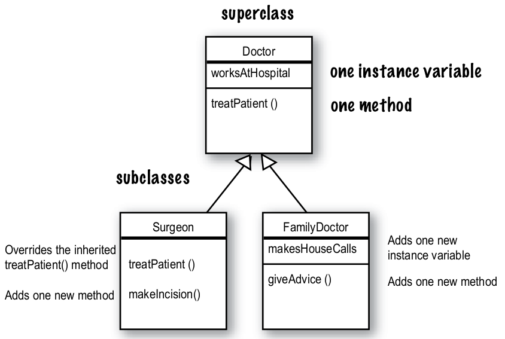

# Inheritance dan Polymorphism

## 1. Inheritance

### 1.1 Definisi Inheritance
Hubungan pewarisan (_inheritance_) adalah hubungan ketika sebuah kelas mewarisi membernya (`attribute` dan `method`) dari kelas lainnya. Di dalam konsep _inheritance_, terdapat 3 istilah penting:

1. `superclass (parent class)`: Kelas yang mewariskan membernya ke `subclass`. Kelas ini bersifat lebih umum.
2. `subclass (child class)`: Kelas yang mewarisi membernya dari `superclass`. Kelas ini bersifat lebih khusus.
3. `extends`: Kata kunci untuk melakukan pewarisan dalam bahasa Java. Formatnya adalah: `[subclass] extends [superclass]`

### 1.2 Kenapa Inheritance Penting?
Konsep ini sangat penting dalam *Object Oriented Programming* karena:

* `Code Reusabilitiy`: method yang ada di `superclass` dijamin dapat diakses di `subclass`. Jadi, tidak perlu menulisnya ulang. Hal ini memungkinkan kode program menjadi lebih *clean* dan modular.
* `Method Overriding`: `subclass` dapat mengambil alih method yang ada di `superclass` dengan menggantinya dengan kebutuhan yang lebih spesifik. Hal ini memungkinkan terjadinya polimorfisme (`polymorphism`) yang akan dibahas setelah bab ini.

### 1.3 Implementasi Inheritance

Untuk memperoleh gambaran yang lebih jelas, mari kita lihat contoh di bawah ini.



Pada gambar di atas, kelas `Doctor` adalah `superclass` karena mewariskan member-membernya ke kelas `Surgeon` dan `FamilyDoctor`. Sedangkan, kelas `Surgeon` dan `FamilyDoctor` adalah `subclass` karena mewarisi member-membernya dari kelas `Doctor`.

Selain itu, `subclass` juga bisa menambahkan member baru dan/atau mengambil alih method yang sudah ada (_override_). Mari lihat contoh sederhana di bawah ini:

File `classes/Doctor.java`

```Java
public class Doctor {
  protected boolean worksAtHospital;

  public Doctor(boolean worksAtHospital) {
    this.worksAtHospital = worksAtHospital;
  }

  public void treatPatient() {
    System.out.println("Memeriksa pasien...");
  }

  // berikan tambahan setter
  public void setWorksAtHospital(boolean worksAtHospital){
    this.worksAtHospital = worksAtHospital;
  }

  // berikan tambahan getter
  public boolean getWorksAtHospital() {
    return this.worksAtHospital;
  }
}
```

File `classes/Surgeon.java`

```Java
public class Surgeon extends Doctor {
  public Surgeon(boolean worksAtHospital) {
    super(worksAtHospital);
  }

  // Method overriding
  @Override
  public void treatPatient() {
    System.out.println("Membedah pasien...");
  }

  public void makeIncision() {
    System.out.println("Membuat irisan di kulit...");
  }
}

```

File `classes/FamilyDoctor.java`

```Java
public class FamilyDoctor extends Doctor {
  private boolean makeHouseCalls;

  public FamilyDoctor(boolean worksAtHospital, boolean makeHouseCalls) {
    super(worksAtHospital);
    this.makeHouseCalls = makeHouseCalls;
  }

  public void giveAdvice() {
    System.out.println("Memberikan anjuran dokter...");
  }

  // berikan tambahan getter
  public boolean getMakeHouseCalls() {
    return this.makeHouseCalls;
  }
}
```

File `Main.java`

```Java
public class Main {

  public static void main(String[] args) {
    // Instansiasi kelas Doctor
    // 1. Kenapa atribute pada kelas Doctor tidak bisa diakses?
    Doctor doctor = new Doctor(true);
    doctor.setWorksAtHospital(false);
    System.out.println("Doctor: " + doctor.getWorksAtHospital());
    doctor.treatPatient();

    // Instansiasi kelas FamilyDoctor
    // 2. Kenapa setWorksAtHospital juga bisa diakses di subclass?
    FamilyDoctor familyDoctor = new FamilyDoctor(false, true);
    familyDoctor.setWorksAtHospital(true);
    System.out.println("FamilyDoctor: " + familyDoctor.getWorksAtHospital());
    System.out.println("FamilyDoctor: " + familyDoctor.getMakeHouseCalls());

    // Instansiasi kelas Surgeon
    // 3. Kenapa method treatPatient di object surgeon berbeda dengan object doctor?
    Surgeon surgeon = new Surgeon(true);
    surgeon.treatPatient();
    surgeon.makeIncision();
  }
}
```

Apakah programnya sudah dijalankan? Yuk jawab ketiga pertanyaan di atas :)

## 2. Polymorphism

### 2.1 Definisi Polymorphism
`Polymorphism` memiliki arti "banyak bentuk". Prinsip ini memungkinkan untuk terjadi ketika kita punya banyak kelas yang berhubungan satu sama lain melalui prinsip `inheritance`. Dengan `polymorphism`, kita dapat melakukan satu tugas dengan banyak cara.

Masih bingung? Tahukah kamu bahwa di bab sebelumnya anda telah melakukan `polymorphism`?

Iya. Di bab sebelumnya, kamu telah melakukan `polymorphism by method overriding` pada saat memanggil method `treatPatient()` di object dari class `Doctor` dan `Surgeon`. Perhatikan bahwa perintah tersebut adalah 1 tugas yang sama, tapi setiap object melakukannya dengan cara yang berbeda.

Nah sekarang, kita akan melakukan sesuatu yang lebih menantang, yaitu `polymorphism by variable`. Kenapa menantang? Karena kita akan bermain dengan *reference variable*.

#### 2.1.1 Sedikit Tentang Reference Variable
Pertama, kita ketahui dulu apa itu `reference variable`. Perhatikan sebaris kode berikut:

```Java
Human manusia = new Human();
```

Kode di atas dapat kita pahami sebagai berikut:

Pertama, kode di bawah ini akan mendeklarasikan reference variable dengan tipe `Manusia`.
```Java
Human manusia
```

Kedua, kode di bawah ini akan membuat object baru dengan tipe `Manusia`.

Ketiga, kode di bawah ini akan menghubungkan reference variable ke object baru dengan tipe yang sama.

```Java
Human manusia = new Human();
```

Di dalam `polymorphism`, bisa saja kita mendeklarasikan reference variable dengan tipe yang berbeda dengan object yang dibuat. Perhatikan subbab setelah ini yaaa.

### 2.2 Implementasi Polymorphism
 
Kita akan langsung melihat bagaimana `polymorphism by variable` bekerja:

File `ProgrammingLanguage.java`:
```Java
public class ProgrammingLanguage {
  public boolean isCompiled;
  public String paradigm;

  // default contructor
  public ProgrammingLanguage() {
    this.isCompiled = false;
    this.paradigm = null;
  }

  // constructor overloading
  public ProgrammingLanguage(boolean isCompiled, String paradigm) {
    this.isCompiled = isCompiled;
    this.paradigm = paradigm;
  }

  public void display() {
    
    if (isCompiled == false && paradigm == null) {
      // jika menggunakan default constructor, maka akan dipanggil
      System.out.println("It's a programming language");
    } else {
      // jika tidak menggunakan default constructor, maka akan dipanggil
      String type = isCompiled ? "compiled" : "interpreted";
      System.out.println("It's a " + type + " and " + paradigm + " language...");
    }

  }
}
```

File `C.java`:
```Java
public class C extends ProgrammingLanguage {
  public boolean hasPointer = true;

  public C() {
    super(true, "imperative");
  }

  public void display() {
    System.out.println("It's a C programming language");
    super.display();
  }
}

```

File `Java.java`:
```Java
public class Java extends ProgrammingLanguage {
  public boolean hasJVM = true;

  public Java() {
    super(true, "object-oriented");
  }

  public void display() {
    System.out.println("It's a Java programming language");
    super.display();
  }
}

```

File `Python.java`:
```Java
public class Python extends ProgrammingLanguage {
  public boolean isLooselyTyped = true;

  public Python() {
    super(false, "OOP");
  }

  public void display() {
    System.out.println("It's a Python programming language");
    super.display();
  }
}
```

File `Main.java`:
```Java
public class Main {

  public static void main(String[] args) {
    // Biasanya, kita hanya membuat object baru dengan tipe yang sama dengan reference variable-nya
    ProgrammingLanguage programmingLanguage = new ProgrammingLanguage();
    programmingLanguage.display();

    System.out.println();
    
    // Bagaimana jika kita membuatnya berbeda?
    ProgrammingLanguage cLanguage = new C();
    cLanguage.display();

    System.out.println();

    // Bagaimana jika kita membuatnya berbeda?
    ProgrammingLanguage javaLanguage = new Java();
    javaLanguage.display();

    System.out.println();

    // Bagaimana jika kita membuatnya berbeda?
    ProgrammingLanguage pythonLanguage = new Python();
    pythonLanguage.display();
  }
}

```

Bagaimana, apakah ada sesuatu yang terjadi? 

Dapat dilihat bahwa kita sedang melakukan `downcasting`, yaitu sebuah *typecasting* tetapi dari `superclass` menjadi `subclass` sehingga kita dapat mengakses methodnya.

Namun, apa hubungannya dengan `polymorphism`?

Coba lihat ketika prosedur `display` dipanggil. Outputnya akan berbeda-beda walaupun reference variable-nya sama. Output yang berbeda tersebut disebabkan oleh perbedaan object yang diinstansiasikan melalui `downcasting`.

Misalnya, 

```Java
ProgrammingLanguage cLang = new C();

// akan memiliki implementasi method yang berbeda dengan

ProgrammingLanguage javaLang = new Java();
```

Di sini, kita telah melakukan 1 tugas (`display`), namun dengan banyak cara. Inilah `polymorphism`.

Mari kita sedikit bermain mengenai `polymorphic list`. Ganti function body dari prosedur `main` yang ada di `Main.java` menjadi seperti berikut:

```Java
int arrLength = 4;

ProgrammingLanguage [] programmingLanguages = new ProgrammingLanguage[arrLength];
programmingLanguages[0] = new ProgrammingLanguage();
programmingLanguages[1] = new C();
programmingLanguages[2] = new Java();
programmingLanguages[3] = new Python();

for(int i = 0; i < arrLength; i++){
  programmingLanguages[i].display();
  System.out.println();
}
```

Apa yang terjadi? Mari kita berdiskusi...