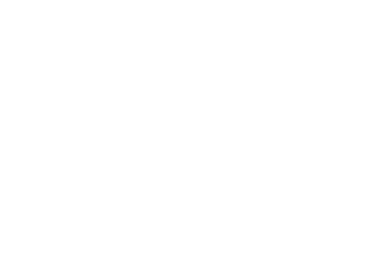

# Overriding & Overloading

## 1. Overriding

### 1.1 Definisi Overriding

`Overriding` adalah salah satu konsep dalam pemrograman berorientasi objek (OOP) yang memungkinkan sebuah `subclass` untuk menggantikan implementasi metode yang sudah didefinisikan dalam `superclass`. Dengan kata lain, subclass dapat menyediakan implementasi yang berbeda untuk metode yang sama yang sudah ada dalam `superclass`.

### 1.2 Kegunaan dan Keuntungan Overriding

1. `Fleksibilitas` : Overriding memungkinkan kita untuk mengganti perilaku default yang diwarisi dari superclass. Ini memungkinkan kita untuk memodifikasi atau mengkustomisasi perilaku metode sesuai dengan kebutuhan kelas turunan (subclass).

2. `Perbaikan Kesalahan` : Jika implementasi metode di superclass terbukti memiliki kesalahan atau perlu diperbaiki, kita dapat melakukan perbaikan hanya di kelas turunan tanpa memengaruhi kelas lain yang menggunakan metode tersebut.

### 1.3 Implementasi Overriding

Untuk memperoleh gambaran yang lebih jelas, mari kita lihat contoh di bawah ini.



Pada gambar diatas kita memiliki `superclass` yang bernama (`"Shape"`) dan memiliki `subclasses` bernama (`"Circle"` dan `"Rectangle"`).

child dari parent akan mendapatkan semua metode dari parent ( `Shape` ) tugas kita sekarang adalah meng-`Override` metode dari parent yang telah dibuat sebelumnya.

mari kita amati code dibawah :

#### File `classes/Shape.java` ( `Superclass` )

```java
public class Shape {
    public void draw() {
        System.out.println("Menggambar bentuk umum.");
    }

    public double calculateArea() {
        System.out.println("Menghitung luas bentuk umum.");
        return 0;
    }
}

```

#### File `classes/Circle.java` ( `subclass` )

```Java
public class Circle extends Shape {
    private double radius;

    public Circle(double radius) {
        this.radius = radius;
    }

    @Override
    public void draw() {
        System.out.println("Menggambar lingkaran dengan radius " + radius);
    }

    @Override
    public double calculateArea() {
        return Math.PI * radius * radius;
    }
}
```

#### File `classes/Rectangle.java` ( `subclass` )

```java
public class Rectangle extends Shape {
    private double length;
    private double width;

    public Rectangle(double length, double width) {
        this.length = length;
        this.width = width;
    }

    @Override
    public void draw() {
        System.out.println("Menggambar persegi panjang dengan panjang " + length + " dan lebar " + width);
    }

    @Override
    public double calculateArea() {
        return length * width;
    }
}

```

#### File `Main.java`

```java
public class Main {
    public static void main(String[] args) {
        Shape[] shapes = new Shape[3];
        shapes[0] = new Circle(5.0);
        shapes[1] = new Rectangle(4.0, 6.0);
        shapes[2] = new Shape();

        for (Shape shape : shapes) {
            shape.draw();
            double area = shape.calculateArea();
            System.out.println("Luas: " + area);
            System.out.println();
        }
    }
}
```

### Soal :

```bash
Buatlah subclass baru bernama Triangle dan override methode draw() dan calculateArea() dengan mengimplementasikan rumus segitiga didalamnya.
```
