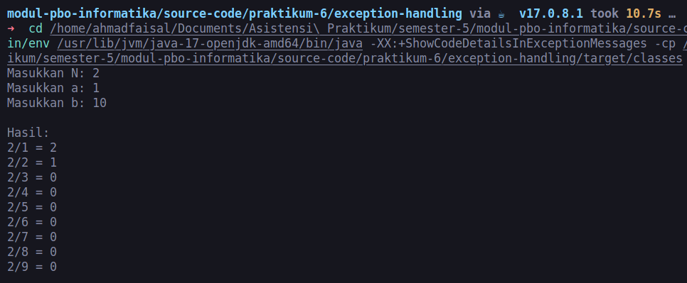
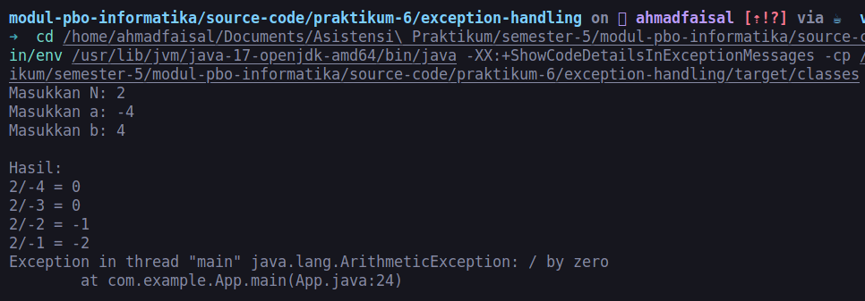
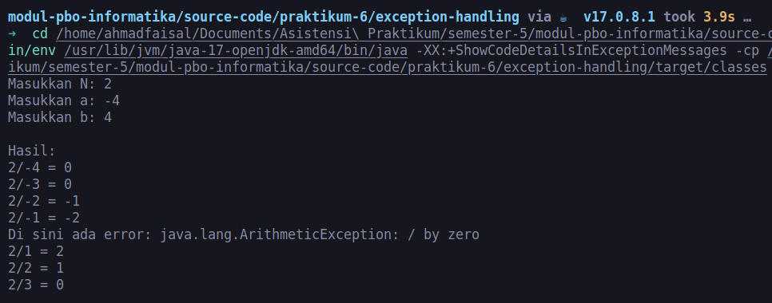
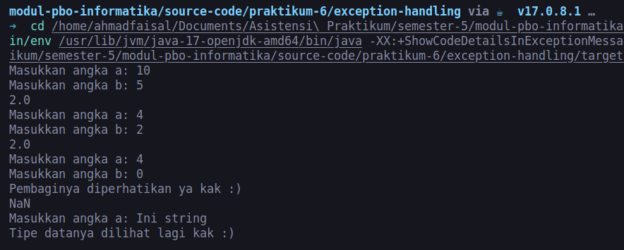
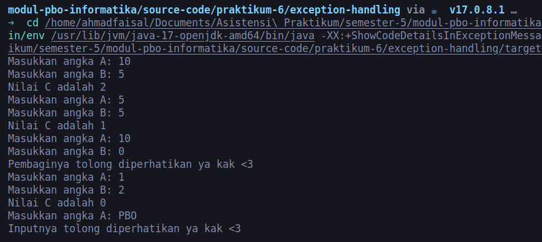
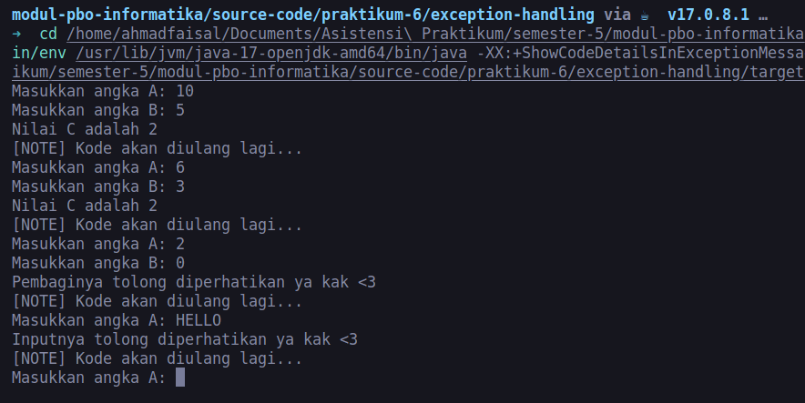
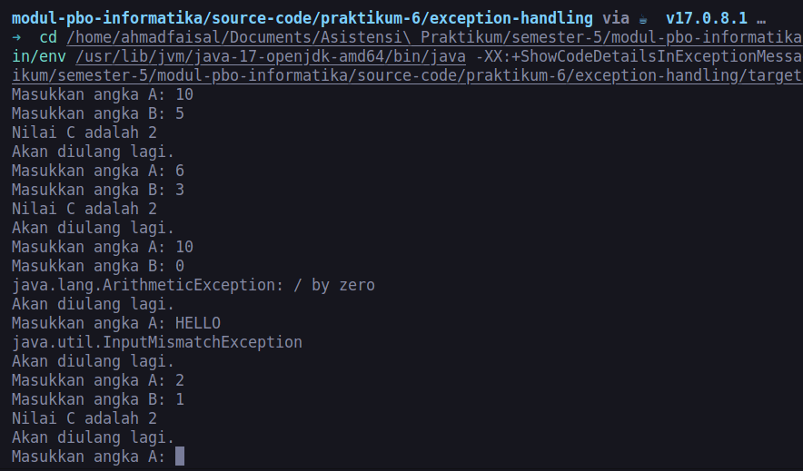
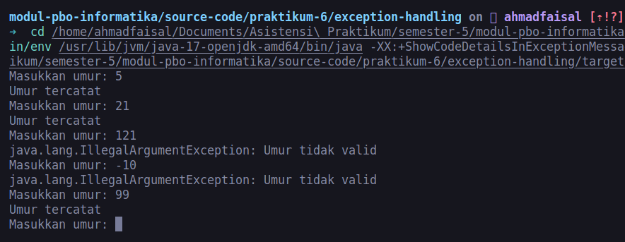

# Exception Handling

Sebelum membahas apa itu exception handling, mari kita masuk ke studi kasus...

## 1. Pengenalan dan Studi Kasus

Kunci dalam membangun algoritma adalah dengan menuliskan detail langkah-langkah yang dilakukan secara hati-hati. Walaupun algoritma telah ditulis dan dapat berjalan, terkadang terdapat suatu kondisi tertentu yang dapat membuat kode program gagal dijalankan atau berhenti di tengah proses eksekusi. Contoh sederhananya adalah adalah seperti kasus berikut:

Kita ingin menampilkan hasil pembagian dari suatu bilangan bulat $N$ dengan setiap bilangan bulat $i$ yang memenuhi $a \leq i < b$ . Untuk menyelesaikan masalah tersebut, kita bisa membuat algoritma berikut:

`````Java
package com.example;

import java.util.Scanner;

public class App {
	public static void main(String[] args) {
		Scanner scanner = new Scanner(System.in);

		System.out.print("Masukkan N: ");
		int N = scanner.nextInt();

		System.out.print("Masukkan a: ");
		int a = scanner.nextInt();

		System.out.print("Masukkan b: ");
		int b = scanner.nextInt();

		System.out.println("\nHasil:");
		for (int i = a; i < b; i++) {
			System.out.println(N + "/" + i + " = " + N / i);
		}

		scanner.close();
	}
}

`````

Kode program di atas akan berjalan lancar apabila kita ambil contoh kasus $N=2$, $a=1$, dan $b=10$, yangmana menghasilkan output sebagai berikut:



Tapi, bagaimana jika kita mencoba kasus $N=2$, $a=-4$, dan $b=4$? Perhatikan output berikut:



Pada kasus kedua, terjadi error di tengah berjalannya program (`java.lang.ArithmeticException: / by zero`). Error ini terjadi karena kita 'tidak menyangka' bahwa ada suatu kasus yang tidak terduga (yaitu pembagian oleh 0 -> tidak terdefinisi), yangmana menyebabkan proses interpretasi bytecode oleh JVM dihentikan. Kejadian ini dinamakan dengan `Runtime Error`.  Selain error di atas, ada banyak kondisi lain yg menyebabkan error juga, seperti:

- Melakukan parsing string non-numerik menjadi float atau integer, contohnya `int i = Integer.parseInt(s)`. Padahal `s = "this is string"`. Ini disebut `NumberFormatException`.
- Mengakses list/array di luar jangkauan index, contohnya `System.out.println(myArray[i])` padahal `myArray.length < i`. Ini disebut `ArrayIndexOutOfBoundsException`.
- Mencoba mengakses sebuah variabel padahal nilainya null. Ini disebut `NullPointerException`.
- dan lain-lain.

Maka dari itu **Exception Handling** diperlukan untuk menangani Runtime Error dengan cara mencegah pemberhentian jalannya program yang dieksekusi. Untuk memberikan gambaran awal, kita akan mencoba melakukan Exception Handling pada kasus pembagian oleh 0 sebelumnya. Perhatikan kode program berikut:

`````Java
package com.example;

import java.util.Scanner;

public class App {
	public static void main(String[] args) {
		Scanner scanner = new Scanner(System.in);

		System.out.print("Masukkan N: ");
		int N = scanner.nextInt();

		System.out.print("Masukkan a: ");
		int a = scanner.nextInt();

		System.out.print("Masukkan b: ");
		int b = scanner.nextInt();

		System.out.println("\nHasil:");
		for (int i = a; i < b; i++) {
			try {
				System.out.println(N + "/" + i + " = " + N / i);
			} catch (ArithmeticException error) {
				System.out.println("Di sini ada error: " + error.toString());
			}
		}

		scanner.close();
	}
}
`````

Kode program di atas akan menghasilkan output berikut:



Dapat dilihat pada saat $i=0$, tidak terjadi error pada program sehingga dapat berjalan dengan baik hingga akhir. Hal ini karena JVM akan mencoba perintah di dalam statement `try` terlebih dahulu (yaitu perintah yang berpotensi menghasilkan error). Apabila perintah tersebut benar-benar menghasilkan error, maka perintah di dalam statement `try` akan 'dikecualikan', lalu JVM akan menjalankan perintah yang ada pada statement `catch`.

## 2. Exception Handling

### 2.1 Try and Catch
`Try and Catch` merupakan salah satu exception handling yang bertugas untuk menangani `Runtime Error` atau error yang terjadi selama program itu dijalankan. `try catch` terdiri dari 2 bagian yaitu `try` dan `catch`.

1. Try, merupakan bagian yang menandakan bahwa blok program yang dimuatnya adalah suatu kode program yang memiliki kemungkinan terjadinya runtime error.
2. Catch, merupakan bagian yang menandakan bahwa blok program yang dimuatnya adalah kode program yang akan dijalankan ketika error runtime terjadi pada try.

`Try and Catch` dapat dituliskan seperti berikut:

``````Java
try{
  // suspicious code
}catch(NamaException e){
  // kode yang akan dijalankan ketika error runtime terjadi
  // e merupakan object error
}
``````
Contoh dari penerapan `Try and Catch` dapat dilihat pada kode program di bawah ini : 

``````Java
import java.util.InputMismatchException;
import java.util.Scanner;

public class App {
	public static double calculate(int a, int b) {
		try {
			return a / b;
		} catch (ArithmeticException e) {
			System.out.println("Pembaginya diperhatikan ya kak :)");
			return Double.NaN; // Return NaN (Not a Number)
		}
	}

	public static void main(String[] args) {
		Scanner scanner = new Scanner(System.in);

		while (true) {
			try {
				System.out.print("Masukkan angka a: ");
				int a = scanner.nextInt();

				System.out.print("Masukkan angka b: ");
				int b = scanner.nextInt();

				double result = calculate(a, b);
				System.out.println(result);
			} catch (InputMismatchException e) {
				System.out.println("Tipe datanya dilihat lagi kak :)");
				scanner.nextLine();
				break;
			}

		}

		scanner.close();
	}
}
``````
Output : 



Pada kondisi di atas, terdapat tambahan pada bagian `catch`, yaitu untuk menangkap jenis error runtime yang terjadi. Error runtime yang terjadi adalah saat user memasukkan tipe data yang tidak cocok (*mismatch*) dengan variable input.

| Jenis Error Runtime | Deskripsi |
| -- | -- |
| `ArithmeticException` | Terjadi ketika terdapat pembagian oleh nol (nilai pembagi adalah 0) |
| InputMismatchException | Terjadi ketika terdapat masalah pada tipe data yang dimasukkan (pada saat menggunakan `Scanner.nextInt()`, misalnya) | 
| `ClassCastException` | Terjadi ketika konversi tipe data tidak valid dilakukan (operasi tidak memungkinkan dengan tipe data tersebut) |
| `IOException` | Terjadi ketika ada masalah dengan operasi I/O, seperti membuka file eksternal |
| `NullPointerException` | Terjadi ketika terdapat percobaan untuk menggunakan objek yang null (misalnya, memanggil metode pada objek yang belum diinisialisasi) | 
| `ArrayIndexOutOfBoundsException` | Terjadi ketika terdapat upaya pengaksesan elemen array atau list pada indeks yang tidak valid |

Berdasarkan tabel di atas kita mengetahui bahwa run time error memiliki banyak jenis, untuk itu kita dapat menggunakan beberapa `catch` pada satu `try` untuk menangkap beberapa jenis error runtime yang berpotensi terjadi. Contoh dari implementasi dari hal tersebut dapat dilihat pada kode program berikut : 

``````Java
import java.util.InputMismatchException;
import java.util.Scanner;

public class App {
	public static void main(String[] args) {
		Scanner scanner = new Scanner(System.in);

		while (true) {
			try {
				System.out.print("Masukkan angka A: ");
				int a = scanner.nextInt();

				System.out.print("Masukkan angka B: ");
				int b = scanner.nextInt();

				int c = a / b;
				System.out.println("Nilai C adalah " + c);
			} catch (ArithmeticException e) {
				System.out.println("Pembaginya tolong diperhatikan ya kak <3");
			} catch (InputMismatchException e) {
				System.out.println("Inputnya tolong diperhatikan ya kak <3");
				scanner.nextLine(); // Consume the invalid input
				break;
			}
		}
		scanner.close();
	}
}

``````
Output : 



Dapat dilihat pada output di atas bahwa pesan error runtime yang dioutputkan dapat disesuaikan dengan error runtime yang terjadi dan program tetap berjalan/tidak berhenti ketika terjadi error. Exception yang dituliskan tidak terbatas 2 tetapi dapat dituliskan sebanyak mungkin.

### 2.2 Finally

Bagaimana jika kita ingin ada perintah yang dijalankan tanpa peduli apakah terjadi error atau tidak? Kita bisa menggunakan `finally`. Perhatikan contoh berikut:

``````Java
import java.util.InputMismatchException;
import java.util.Scanner;

public class App {
	public static void main(String[] args) {
		Scanner scanner = new Scanner(System.in);

		while (true) {
			try {
				System.out.print("Masukkan angka A: ");
				int a = scanner.nextInt();

				System.out.print("Masukkan angka B: ");
				int b = scanner.nextInt();

				int c = a / b;
				System.out.println("Nilai C adalah " + c);
			} catch (ArithmeticException e) {
				System.out.println("Pembaginya tolong diperhatikan ya kak <3");
			} catch (InputMismatchException e) {
				System.out.println("Inputnya tolong diperhatikan ya kak <3");
				scanner.nextLine(); // Consume the invalid input
			}finally {
				System.out.println("[NOTE] Kode akan diulang lagi...");
			}
		}
	}
}

``````

Output : 



Dapat dilihat bahwa perintah yang ada di block `finally` akan tetap dieksekusi tanpa peduli terjadi error atau tidak pada block `try`.

### 2.3 Satu untuk Semua...

Kembali pada tabel jika dilihat terdapat banyak jenis dari error runtime yang terjadi, dengan begitu banyaknya jenis runtime error apakah kita perlu menuliskan semua jenis exception tersebut?🤔 TENTU TIDAK!!!

Kita dapat menuliskan satu exception saja untuk menampung banyak exception seperti contoh pertama. Dengan menggunakan satu exception atau beberapa exception keduanya sama sama hanya akan menangkap error runtime pertama yang muncul. Untuk itu, perhatikan kode program di bawah ini : 

``````Java
import java.util.InputMismatchException;
import java.util.Scanner;

public class DivisionCalculator {
    public static void main(String[] args) {
        Scanner scanner = new Scanner(System.in);

        while (true) {
            try {
                System.out.print("Masukkan angka A: ");
                int a = scanner.nextInt();

                System.out.print("Masukkan angka B: ");
                int b = scanner.nextInt();

                int c = a / b;
                System.out.println("Nilai C adalah " + c);
            } catch (Exception e) {
                System.out.println(e.toString());
            } finally {
                System.out.println("Akan diulang lagi.");
            }
        }
    }
}

``````
Output : 



Dapat dilihat di atas bahwa output dari exception akan menyesuaikan dengan error runtime yang terjadi, sehingga kita tidak perlu menuliskan seluruh jenis exception.

### 2.4 Throw

Jika pada `Exception Handling` sebelumnya yaitu Exception yang terjadi adalah kondisi error yang telah ditentukan oleh Java, maka bagaimana jika kita ingin membuat kondisi error sesuai dengan kebutuhan kita?🤔 untuk menjawab kebutuhan tersebut maka digunakanlah `Throw`. Dengan menggunakan `throw` kita dapat membuat error runtime kita sendiri. Contoh dari `throw` dapat dilihat pada kode program berikut : 

``````Java
import java.util.InputMismatchException;
import java.util.Scanner;

public class App {
	public static void main(String[] args) {
		Scanner scanner = new Scanner(System.in);

		while (true) {
			try {
				System.out.print("Masukkan umur: ");
				int umur = scanner.nextInt();

				if (umur < 0 || umur > 120) {
					throw new IllegalArgumentException("Umur tidak valid");
				}

				System.out.println("Umur tercatat");
			} catch (InputMismatchException e) {
				System.out.println("Input tidak valid, masukkan angka.");
				scanner.nextLine(); // Consume the invalid input
			} catch (IllegalArgumentException e) {
				System.out.println(e.toString());
			} catch (Exception e) {
				System.out.println("Terjadi kesalahan lainnya.");
			}
		}
	}
}
``````

Output : 



Dapat dilihat ketika input umur melebihi 120 atau kurang dari 0, maka akan di-outputkan throw error runtime yang ditentukan.