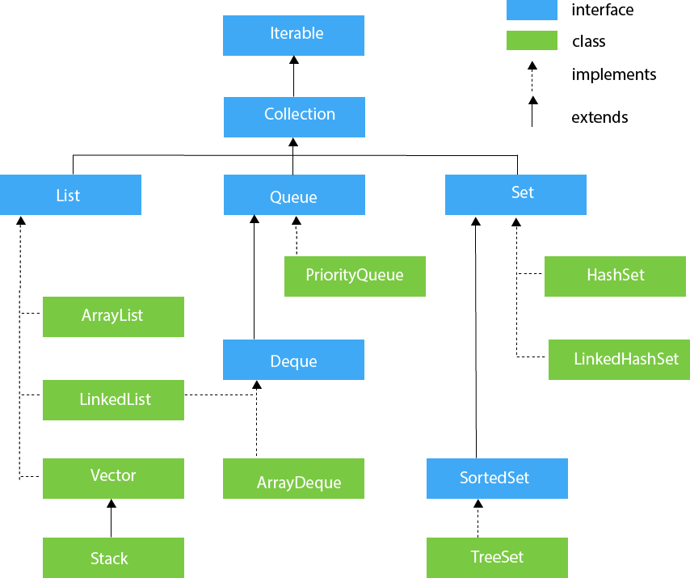

# Java Standard Library

Library (pustaka) adalah kumpulan source code yang sudah disediakan sehingga dapat digunakan oleh user untuk mempercepat dalam melakukan tugas tertentu. Dalam bahasa pemrograman Java, telah disediakan library bawaan yang bernama "Java Standard Library". Library ini telah menyediakan kebutuhan-kebutuhan dasar untuk memudahkan pengguna Java. Secara sederhana, library Java dapat digambarkan sebagai berikut:


Tetapi, jika ingin lebih lengkap, silakan untuk mengunjungi dokumentasi Java Standard Edition API versi 17 di [https://docs.oracle.com/en/java/javase/17/docs/api/index.html](https://docs.oracle.com/en/java/javase/17/docs/api/index.html). Library-library dasar yang akan dipelajari pada modul ini pada pada module `java.base` yang mana di dalamnya akan ada banyak package seperti `java.io`, `java.lang`, `java.math`, dan lain-lain.

Apabila penasaran, kamu bisa melihat source code dari library ini dengan mengunjungi path berikut di sistem operasi anda:

```
Windows:
/c/Program Files/Java/jdk-17/lib/src.zip

Linux:
/usr/lib/jvm/java-17-openjdk-amd64/lib/src.zip
```

Coba unzip file `src.zip`, kemudian masuk ke `src/java.base/java/`. Maka kamu akan menemui beberapa folder seperti `lang`, `util`, dan `io`. Di sana, kamu dapat mempelajari source code dari Standard Library Java, bahkan melakukan modifikasi sendiri.

## Collection

Dokumentasi: [https://docs.oracle.com/en/java/javase/17/docs/api/java.base/java/util/package-summary.html](https://docs.oracle.com/en/java/javase/17/docs/api/java.base/java/util/package-summary.html)

**Collection** merupakan *framework* yang menyediakan struktur data untuk menyimpan dan memanipulasi kumpulan objek. Framework ini juga menyediakan banyak operasi untuk melakukan tugas-tugas tertentu, misalnya searching, sorting, dan lain-lain.

Dalam artian sederhana, **Collection** adalah **Struktur Data**.

Berikut adalah hierarki dari framework Collection yang ada di package `java.util`.



Sebagai contoh, kita akan mencoba untuk menggunakan `List`.

```java
package com.example;

import java.util.ArrayList;
import java.util.List;

public class Main {
    public static void main(String[] args) {
        // Declare and initiate new ArrayList object
        List<String> blackpinkMembers = new ArrayList<String>();

        // Add 4 new members
        blackpinkMembers.add("Lisa");
        blackpinkMembers.add("Jennie");
        blackpinkMembers.add("Rose");
        blackpinkMembers.add("Jisoo");

        // For each member in blackpinkMembers, print member
        System.out.println("All members:");
        blackpinkMembers.forEach(member -> System.out.println(member));

        // Remove member in blackpinkMembers if member is "Jennie"
        blackpinkMembers.removeIf(member -> member == "Jennie");

        // For each member in blackpinkMembers, print member
        System.out.println("All members after removed Jennie:");
        blackpinkMembers.forEach(member -> System.out.println(member));

        // Add Jennie in blackpinkMembers again
        blackpinkMembers.add("Jennie");

        // Ascending-sort based on Unicode value
        blackpinkMembers.sort((member1, member2) -> member1.compareTo(member2));

        // For each member in blackpinkMembers, print member
        System.out.println("All members after sorted:");
        blackpinkMembers.forEach(member -> System.out.println(member));

        // Remove all members from blackpinkMembers
        blackpinkMembers.removeAll(blackpinkMembers);

        // For each member in blackpinkMembers, print member
        System.out.println("All members after removed:");
        blackpinkMembers.forEach(member -> System.out.println(member));
    }
}
```

Selain `ArrayList`, tentu saja Collection menyediakan banyak struktur data lain seperti `LinkedList`, `Vector`, `HashSet`, dan lain-lain. Silakan untuk mencoba class dan method-methodnya dengan melihat referensi dari dokumentasi resmi yang telah disediakan di atas.

## Iterator

Dokumentasi: [https://docs.oracle.com/en/java/javase/17/docs/api/java.base/java/util/Iterator.html](https://docs.oracle.com/en/java/javase/17/docs/api/java.base/java/util/Iterator.html)

Iterator merupakan interface yang menyediakan cara untuk melakukan iterasi elemen pada Collection dengan arah maju. Interface ini memiliki 4 method saja, yaitu:

| Modifier dan Tipe Return | Method | Penjelasan |
| -- | -- | -- |
| `default void`| `forEachRemaining(Consumer<? super E> action)` | Melakukan aksi untuk setiap sisa elemen hingga semua elemen sudah diproses atau terjadi sebuah exception. |
| `boolean` | `hasNext()` | Mengembalikan `true` jika iterasi masih memiliki elemen lagi |
| `E` | `next` | Mengembalikan nilai elemen selanjutnya pada iterasi |
| `default void` | `remove` | Menghapus elemen yang sedang diiterasi oleh iterator saat ini (jarang digunakan) |

**Catatan**: `E` merupakan generic type, jadi disesuaikan dengan tipe data dari collection yang ingin diiterasi.

Sebagai contoh, perhatikan dan coba source code berikut:

```java
package com.example;

import java.util.ArrayList;
import java.util.Iterator;
import java.util.List;

public class Main {
    public static void main(String[] args) {
        // Declare and initiate new ArrayList object
        List<String> blackpinkMembers = new ArrayList<String>();

        // Add 4 new members
        blackpinkMembers.add("Lisa");
        blackpinkMembers.add("Jennie");
        blackpinkMembers.add("Rose");
        blackpinkMembers.add("Jisoo");

        // Declare iterator object
        Iterator<String> iter = blackpinkMembers.iterator();

        // If there is an element in the next iteration, print the returned next element value
        while(iter.hasNext()){
            System.out.println(iter.next());
        }

        // Do the same as above operation, but with more compact code
        iter.forEachRemaining(member -> System.out.println(member));

        // Remove element in the current iteration
        iter.remove();

        // Check whether the last element still exists or not
        blackpinkMembers.forEach(member -> System.out.println(member));
    }
}
```